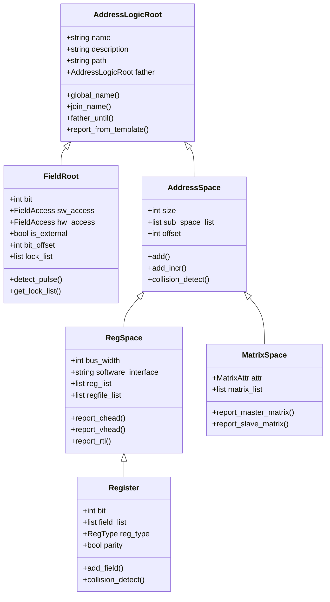
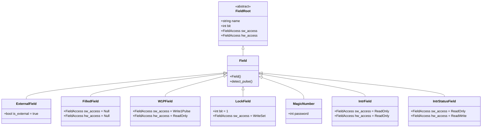
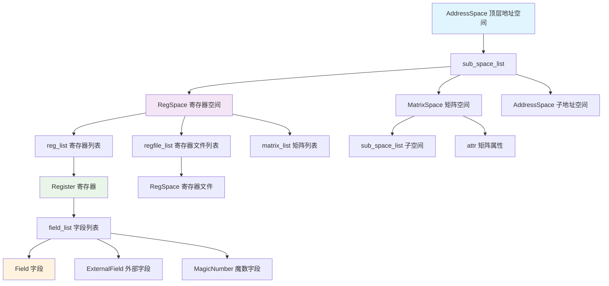
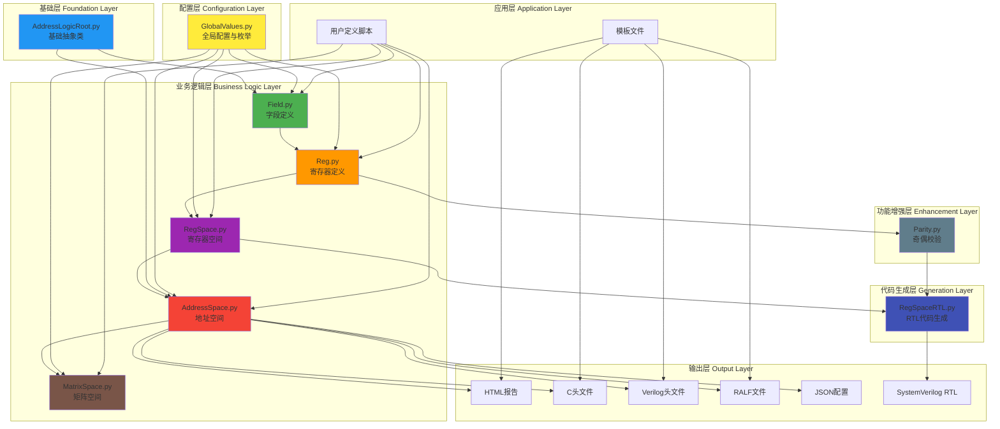
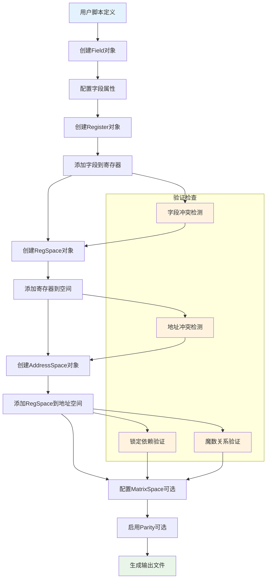
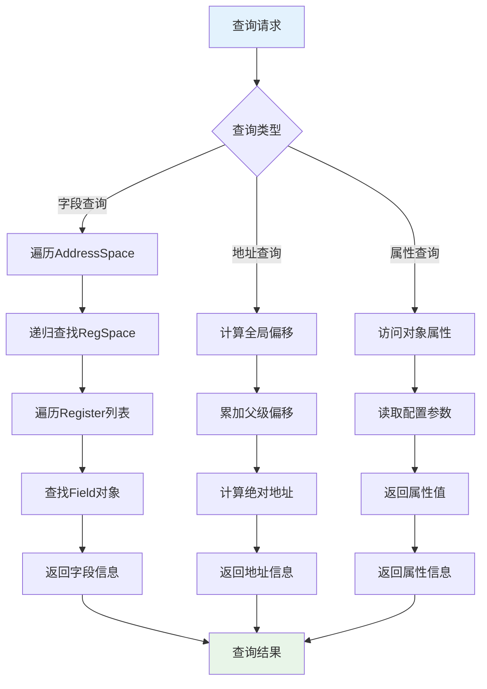

# Address Planner Specification

## 概述

Address Planner 是一个用于生成寄存器模型和地址映射的工具。它提供了一个完整的层次化架构来定义、管理和生成寄存器空间、字段访问控制以及相关的 RTL 代码。

## 文件层次结构

```
address_planner/
├── __init__.py                 # 包初始化文件
├── GlobalValues.py             # 全局常量和枚举定义
├── AddressLogicRoot.py         # 基础逻辑根类
├── Field.py                    # 字段定义和访问控制
├── Reg.py                      # 寄存器定义
├── RegSpace.py                 # 寄存器空间管理
├── AddressSpace.py             # 地址空间管理
├── MatrixSpace.py              # 矩阵空间管理
├── Parity.py                   # 奇偶校验字段
└── RegSpaceRTL.py             # RTL 生成模块
```


## 核心模块详细说明

### 1. GlobalValues - 全局配置模块

**功能描述**: GlobalValues 模块在 address_planner 中负责定义所有全局常量、配置参数和枚举类型，为整个系统提供统一的配置管理和类型定义。它是所有其他模块的基础依赖，确保系统各组件使用一致的配置和类型定义。

#### 1.1 核心常量定义

##### 总线配置常量

- **`APG_BUS_WIDTH = 32`**: 默认总线位宽，决定数据传输的基本单位
- **`APG_DATA_WIDTH = APG_BUS_WIDTH`**: 数据位宽，与总线宽度保持一致
- **`APG_ADDR_WIDTH = 32`**: 地址位宽，决定可寻址的地址空间范围

##### 模板文件路径常量

- **HTML模板文件**:
  - `APG_HTML_FILE_ADDR_SPACE`: 地址空间HTML报告模板
  - `APG_HTML_FILE_REG_SPACE`: 寄存器空间HTML报告模板

- **Verilog头文件模板**:
  - `APG_VHEAD_FILE_ADDR_SPACE`: 地址空间Verilog头文件模板
  - `APG_VHEAD_FILE_REG_SPACE`: 寄存器空间Verilog头文件模板
  - `APG_VHEAD_GLB_FILE_REG_SPACE`: 全局寄存器空间Verilog头文件模板

- **C语言头文件模板**:
  - `APG_CHEAD_FILE_ADDR_SPACE`: 地址空间C头文件模板
  - `APG_CHEAD_FILE_REG_SPACE`: 寄存器空间C头文件模板
  - `APG_CHEAD_GLB_FILE_REG_SPACE`: 全局寄存器空间C头文件模板

- **RAL模型模板**:
  - `APG_ADDR_RMODEL_FILE_REG_SPACE`: 地址级RAL模型模板
  - `APG_REG_RMODEL_FILE_REG_SPACE`: 寄存器级RAL模型模板
  - `APG_REG_RALF_FILE_REG_SPACE`: RALF格式文件模板

##### 存储单位常量

- **`B = 1`**: 字节单位基数
- **`KB = 1024 * B`**
- **`MB = 1024 * KB`**
- **`GB = 1024 * MB`**

#### 1.2 全局配置类

##### Options配置类

```python
class Options:
    MultiPortOption = False     # 多端口选项，控制是否启用多端口地址映射模式
```

- **`MultiPortOption`**: 当设置为True时，放宽地址冲突检测限制，允许更复杂的多端口并行访问（该功能只会出现在Address Mapping中）。

#### 1.3 核心枚举类

**FieldAccess 字段访问类型枚举**:

```python
class FieldAccess(Enum):
    # 基础访问类型
    Null                 = 'reserved'      # 保留字段，无访问权限
    ReadWrite            = 'RW'            # 可读写字段，标准读写操作
    ReadOnly             = 'RO'            # 只读字段，软件只能读取
    WriteOnly            = 'WO'            # 只写字段，软件只能写入
    
    # 读操作特殊行为
    ReadClean            = 'RC'            # 读清零：读操作后字段自动清零
    ReadSet              = 'RS'            # 读置位：读操作后字段自动置位
    
    # 写操作特殊行为  
    WriteClean           = 'WC'            # 写清零：写操作清零字段
    WriteSet             = 'WS'            # 写置位：写操作置位字段
    WriteOnlyClean       = 'WOC'           # 只写清零：只能写入且写入后清零
    WriteOnlySet         = 'WOS'           # 只写置位：只能写入且写入后置位
    WriteOnce            = 'W1'            # 写一次：只能写入一次，后续写入无效
    WriteOnlyOnce        = 'WO1'           # 只写一次：只写且只能写一次
    
    # 读写组合行为
    WriteReadClean       = 'WRC'           # 写读清零：写操作后读取时清零
    WriteReadSet         = 'WRS'           # 写读置位：写操作后读取时置位
    WriteCleanReadSet    = 'WCRS'          # 写清零读置位：写时清零，读时置位
    WriteSetReadClean    = 'WSRC'          # 写置位读清零：写时置位，读时清零
    
    # 条件写操作（基于写入值）
    Write1Clean          = 'W1C'           # 写1清零：写入1时清零该位，写入0无效果
    Write1Set            = 'W1S'           # 写1置位：写入1时置位该位，写入0无效果
    Write0Clean          = 'W0C'           # 写0清零：写入0时清零该位，写入1无效果
    Write0Set            = 'W0S'           # 写0置位：写入0时置位该位，写入1无效果
    
    # 条件写操作与读操作组合
    Write1CleanReadSet   = 'W1CRS'         # 写1清零读置位：写1清零，读时置位
    Write0CleanReadSet   = 'W0CRS'         # 写0清零读置位：写0清零，读时置位
    Write1SetReadClean   = 'W1SRC'         # 写1置位读清零：写1置位，读时清零
    Write0SetReadClean   = 'W0SRC'         # 写0置位读清零：写0置位，读时清零
    
    # 翻转操作
    Write1Toggle         = 'W1T'           # 写1翻转：写入1时翻转该位状态
    Write0Toggle         = 'W0T'           # 写0翻转：写入0时翻转该位状态
    
    # 脉冲信号（硬件专用）
    Write1Pulse          = 'W1P'           # 写1脉冲：写入1时产生一个时钟周期的脉冲
    Write0Pulse          = 'W0P'           # 写0脉冲：写入0时产生一个时钟周期的脉冲
```

**RegType 寄存器类型枚举**:

```python
class RegType(Enum):
    Normal      = 'Normal'                  # 普通寄存器
    Magic       = 'Magic'                   # 魔数寄存器，需要特定值才能解锁
    Lock        = 'Lock'                    # 锁定寄存器，控制其他寄存器的访问权限
    Intr        = 'Interrupt without Mask' # 中断寄存器（无掩码）
    IntrMask    = 'Interrupt with Mask'    # 中断寄存器（带掩码）
    IntrStatus  = 'Interrupt status register' # 中断状态寄存器
```

**IntrBitWidth 中断位宽枚举**:

```python
class IntrBitWidth(Enum):
    Intr     = 160    # 标准中断寄存器组位宽（5个32位寄存器）
    IntrMask = 192    # 带掩码中断寄存器组位宽（6个32位寄存器）
    IntrFull = 256    # 完整中断寄存器组位宽（8个32位寄存器）
```

#### 1.4 端口和字段定义类

##### 端口信号定义

- **`BASE_PORT`**: 基础端口信号定义类，提供VRP接口的标准端口信号
- **`APB_PORT`**: APB总线端口信号定义类，包含APB3/APB4协议的完整端口信号定义

##### 字段信号定义

- **`EXTERNAL_FIELD`**: 外部字段信号定义类，当寄存器字段映射到RegBank外部时使用
- **`INTERNAL_FIELD`**: 内部字段信号定义类，当寄存器字段位于RegBank内部时使用

#### 1.5 其他枚举类

##### GlobalValue枚举

包含系统级的全局配置值和标识符定义，用于统一管理系统范围内的配置参数。


### 2. AddressLogicRoot - 基础逻辑根类

**功能描述**: AddressLogicRoot 模块在 address_planner 中作为所有地址逻辑组件的抽象基类，提供通用的属性管理、名称拼接、父级查找、路径管理以及输出文件生成等基础功能。它为Field、Register、RegSpace、AddressSpace等所有派生类提供了统一的接口和共同的行为模式。

#### 2.1 主要类成员

```python
class AddressLogicRoot:
        def __init__(self, name, description='', path='./'):
                self.init_name = name       # 真实模块名
                self.module_name = name     # 初始化名称
                self.inst_name = ''         # 实例名
                self.description = description
                self.path = path
                self.father = None          # 父级对象
                self._name_prefix = 'addr'
```

#### 2.2 核心方法

- **`global_name`**: 获取全局唯一名称（若有父级则为 parent_global_name + '_' + module_name）
- **`join_name(*args, join_str='_')`**: 连接名称字符串，过滤 None
- **`father_until(T)`**: 向上查找指定类型的父级对象，未找到返回 None
- **`module_name_until(T)`**: 从当前节点到指定类型父级、拼接模块名链

#### 2.3 路径与输出名称管理属性

- **`global_path`**: 顶层 `path`，若有父级则继承父级
- **`output_path`**: 实际输出目录（若有父级則使用父级的 `output_path`，否则为 `os.path.join(global_path, module_name)`）

- **目录属性（基于 `output_path`）**:
    - `_vhead_dir`、`_chead_dir`、`_html_dir`、`_json_dir`、`_rtl_dir`、`_ral_model_dir`、`_ralf_dir`、`_dv_dir`
        - 返回对应的输出子目录路径，用于分别放置 Verilog 头、C 头、HTML 报告、JSON 数据、RTL 代码、RAL 模型、RALF 文件与 DV 相关文件。

- **文件名/路径属性**:
    - `html_name`：返回 `addr_<global_name>.html`
    - `chead_name`：返回 `addr_<init_name>.h`
    - `vhead_name`：返回 `addr_<init_name>.vh`
    - `chead_global_name` / `vhead_global_name`：全局头文件名（如 `all_reg.h` / `all_reg.vh`）
    - `html_path` / `chead_path` / `vhead_path` / `json_path` / `matrix_path`：基于对应目录与文件名返回全路径

#### 2.4 输出/生成方法

- **`clean_dir()`**：删除 `path` 指定目录（使用 `shutil.rmtree`），用于在重新生成输出之前清理旧文件。

- **`build_dir()`**：确保关键输出目录存在（使用 `os.makedirs`），至少会创建 HTML、C 头、Verilog 头、RTL、RALF 等目录，供后续写文件使用。

- **`report_from_template(template, extra_in_namespace={})`**：
    - 使用 `jinja2.Environment`（loader 指向 `address_planner/report_template`）加载模板。
    - 将 `builtins` 注入模板全局命名空间，允许模板访问 Python 内建函数。
    - 将 `extra_in_namespace` 中的键值对注入模板全局命名空间（常用于把额外数据传入模板）。
    - 调用 `template.render(space=self)` 渲染模板并返回渲染后的字符串（通常是 HTML、C 头或 RAL 文件内容）。

这些输出相关方法和属性是 Address Planner 生成输出文件（HTML 报告、C/Verilog 头、RTL 文件、RAL/RALF 模型、JSON/矩阵配置等）的基础。上层模块（如 `RegSpace`、`AddressSpace`、`MatrixSpace`）会组装数据后调用这些属性/方法完成文件写出。


### 3. Field - 字段定义模块

**功能描述**: Field 模块在 address_planner 中负责表示寄存器的最小单元 —— 字段（field）。它继承自 `AddressLogicRoot`，定义字段的位宽、软件/硬件访问权限、初始值、偏移、锁关系，以及一组判断字段行为的属性和方法。该模块为整个寄存器系统提供了最基础的数据单元定义和行为控制。

#### 3.1 核心类：FieldRoot

```python
class FieldRoot(AddressLogicRoot):
        def __init__(self, name, bit,
                                 sw_access=ReadWrite,
                                 hw_access=ReadWrite,
                                 init_value=0,
                                 description=''):
                super().__init__(name=name, description=description)
                self._name = name                    # 字段的标识名称
                self.bit = bit                       # 字段位宽（位数）
                self.sw_access = sw_access           # 软件端访问权限类型
                self.hw_access = hw_access           # 硬件端访问权限类型
                self.is_external = False             # 是否为外部字段（映射到RegBank外部）
                self.bit_offset = 0                  # 字段在寄存器内的起始位偏移
                self.lock_list = []                  # 该字段依赖的锁字段名列表
                self.init_value = init_value         # 字段的复位/默认值（根据access规则可能被重写）
```

#### 3.2 位置和掩码相关属性

- **`start_bit`**：返回 `bit_offset`（字段起始位）。
- **`end_bit`**：返回 `bit_offset + bit - 1`（字段结束位）。
- **`mask`**：按寄存器位宽生成字段的位掩码（hex 字符串），用于 C/HTML 报告等。
- **`mask_vh`**：为 Verilog/视图生成的掩码字符串（例如 `'hFF` 风格）。
- **`hex_value`**：返回字段初始值的位宽限定 hex 字符串（例如 `8'hFF`）。
- **`module_name_until_regbank`**：拼接父寄存器的 init_name 与字段名，常用于生成模块内信号名。

#### 3.3 LockBit和验证方法

##### LockBit管理

- **`get_lock_list`**: 返回解析后的实际锁字段对象列表
  - 合并自身 `lock_list` 与父寄存器的 `lock_list`
  - 在父 `RegSpace` 中查找对应的字段引用
  - 返回真实对象列表或空列表

##### 脉冲检测和验证

- **`detect_pulse()`**: 检查字段是否配置为写脉冲类型（`W1P`/`W0P`）并验证约束条件
  - 验证软件脉冲访问时硬件访问必须为只读
  - 确保外部字段不能配置为写脉冲类型
  - 检查硬件访问不能设置为脉冲类型

- **`lock_self_detect()`**: 检测自锁定和锁列表的正确性（占位实现，可扩展）

#### 3.4 行为判定属性

##### 软件层访问属性（sw_*）

- **`sw_readable`** / **`sw_writeable`**: 判断字段在软件侧是否可读/可写
- **`sw_read_clean`** / **`sw_read_set`**: 判断软件读后是否触发清零或置位
- **`sw_write_clean`** / **`sw_write_set`**: 判断软件写操作是否触发清零或置位
- **`sw_write_one_to_clean`** / **`sw_write_zero_to_clean`**: 判断条件写清零行为
- **`sw_write_one_to_set`** / **`sw_write_zero_to_set`**: 判断条件写置位行为
- **`sw_write_one_to_toggle`** / **`sw_write_zero_to_toggle`**: 判断条件写翻转行为
- **`sw_write_once`**: 判断是否为写一次字段
- **`sw_write_one_pulse`** / **`sw_write_zero_pulse`**: 判断软件写脉冲类型

##### 硬件层访问属性（hw_*）

- **`hw_readable`** / **`hw_writeable`**: 判断字段在硬件侧是否可读/可写
- **`hw_read_clean`** / **`hw_read_set`**: 判断硬件读后是否触发清零或置位
- **`hw_write_clean`** / **`hw_write_set`**: 判断硬件写操作是否触发清零或置位
- **`hw_write_one_to_clean`** / **`hw_write_zero_to_clean`**: 判断条件写清零行为
- **`hw_write_one_to_set`** / **`hw_write_zero_to_set`**: 判断条件写置位行为
- **`hw_write_one_to_toggle`** / **`hw_write_zero_to_toggle`**: 判断条件写翻转行为
- **`hw_write_once`**: 判断是否为写一次字段

#### 3.5 便捷属性

##### 字段状态属性

- **`reserved`**: 当软硬件访问都为 `Null` 时为 True，表示保留字段
- **`field_reg_read`**: 字段是否参与寄存器读回数据
- **`field_reg_write`**: 字段是否会被寄存器写操作影响

#### 3.6 结果生成API

##### JSON报告生成

- **`report_json_core()`**: 返回字段的JSON描述字典
  - 包含 `key`（唯一标识）、`name`、`size`、`Position`（位置）、`External`（是否外部）
  - 包含软硬件访问类型、默认值、描述信息
  - FilledField返回 `Null` 以在报告中隐藏保留位

#### 3.7 常用子类及用途

##### 基础字段类

- **`FilledField(bit)`**: 填充保留位的字段，软硬件访问都为Null
- **`Field(name, bit, ...)`**: 标准字段构造器，会调用脉冲类型验证
- **`ExternalField(...)`**: 外部字段，映射到RegBank外部（`is_external=True`）

##### 特殊功能字段

- **`W1PField`** / **`W0PField`**: 写脉冲字段，软件写1/0生成脉冲，硬件只读
- **`LockField`**: 单比特锁字段，用于控制写保护（WriteSet类型）
- **`MagicNumber`**: 魔数字段，包含password属性，用于解锁逻辑

##### 中断相关字段

- **`IntrField`**: 中断位，软硬件都为只读
- **`IntrStatusField`**: 中断状态位，硬件可写软件只读
- **`IntrEnableField`**: 中断使能位，软件读写
- **`IntrMaskField`**: 中断掩码位，软件读写  
- **`IntrClearField`** / **`IntrSetField`**: 中断清除/设置的写脉冲字段

这些成员和属性为上层 `Register`、`RegSpace`、`Parity` 与 `RegSpaceRTL` 提供了字段级别的语义信息，生成器会根据这些属性选择生成合适的 RTL 接口、mask/mux、读回逻辑以及文档化信息。


### 4. Reg - 寄存器定义模块

**功能描述**: Register 模块在 address_planner 中负责定义单个寄存器单元，管理字段的放置、偏移计算、冲突检测以及各种寄存器级别的功能。它继承自 `RegSpace`，专门针对寄存器内部字段的操作进行优化，同时提供奇偶校验、MagicNumber相关检查和JSON报告等高级功能。

#### 4.1 核心类：Register

```python
class Register(RegSpace):
    def __init__(self, name, bit=32, description='', bus_width=APG_BUS_WIDTH, 
                 reg_type=Normal, lock_list=[], parity=False, rst_domain='rst_n'):
        size = math.ceil(bit/bus_width)
        super().__init__(name=name, size=size, description=description, path='./', bus_width=bus_width)
        self.bit = bit                      # 寄存器位宽
        self._next_offset = 0               # 下一个字段偏移
        self.field_list = []                # 字段列表
        self.reg_type = reg_type            # 寄存器类型
        self.lock_list = lock_list          # 锁定字段列表
        self.magic_list = []                # 魔数寄存器列表
        self.parity = parity                # 奇偶校验使能
        self.rst_domain = rst_domain        # 复位域名称
```

#### 4.2 字段添加API

##### 基础添加方法

- **`add(field, offset=0, name=None, lock_list=[])`**:
  - 将字段对象添加到寄存器的指定位偏移
  - `field`: 要添加的字段对象
  - `offset`: 字段在寄存器内的位偏移（从0开始）
  - `name`: 可选的字段实例名
  - `lock_list`: 该字段依赖的锁字段名列表
  - 会进行字段冲突检测和包含关系验证

- **`add_incr(field, name=None, lock_list=[])`**:
  - 自动递增添加字段，使用 `_next_offset` 作为起始位置
  - 适合顺序布局的字段设计
  - 添加后会自动更新 `_next_offset` 为下一个可用位置

##### 专用添加方法

- **`add_magic(name='field_magic', bit=32, password=0, init_value=0, description='', lock_list=[])`**:
  - 添加魔数字段，用于寄存器解锁机制
  - 自动创建MagicNumber字段并添加到寄存器中

##### Tablelike支持方法

- **`add_field(name, bit, sw_access=ReadWrite, hw_access=ReadWrite, init_value=0, description='')`**:
  - tablelike风格的字段添加方法
  - 支持方法链式调用

- **`field(name, bit, sw_access=ReadWrite, hw_access=ReadWrite, init_value=0, description='', offset=0)`**:
  - 创建字段对象但不立即添加
  - 返回配置好的Field对象

- **`reserved_field(bit)`**:
  - 创建保留字段，用于填充未使用的位

- **`external_field(name, bit, sw_access=ReadWrite, hw_access=ReadWrite, init_value=0, description='', offset=0)`**:
  - 创建外部字段，映射到RegBank外部接口

#### 4.3 地址和位偏移属性

##### 位范围属性

- **`start_bit`**: 返回寄存器的起始位（固定为0）
- **`end_bit`**: 返回寄存器的结束位（`bit - 1`）
- **`start_address`** / **`end_address`**: 返回寄存器在父空间中的字节地址范围

##### 偏移计算属性

- **`bit_offset`**: 返回寄存器的位偏移（`offset * 8`）
- **`hex_offset`**: 返回十六进制格式的偏移地址
- **`reg_offset`**: 计算相对于父模块的偏移值
- **`module_name_until_regbank`**: 生成唯一的模块信号名

#### 4.4 字段管理属性

##### 字段列表视图

- **`sorted_field_list`**: 按位偏移排序的字段列表
- **`filled_field_list`**: 在字段间插入FilledField的完整列表，确保覆盖整个寄存器位宽

##### 初始值合成

- **`init_value`**: 将所有字段的初始值按位偏移合并，返回寄存器的完整复位值

#### 4.5 冲突检测和验证方法

##### 字段冲突检测

- **`collision_detect(field_A, field_B)`**:
  - 检测两个字段的位范围是否重叠
  - 通过比较字段的起始位和结束位判断冲突
  - 返回布尔值表示是否冲突

- **`inclusion_detect(other)`**:
  - 检测字段是否完全包含在寄存器位范围内
  - 用于验证字段添加的合法性

##### MagicNumber和LockBit管理

- **`add_lock_list(lock_list)`**:
  - 向寄存器的锁定列表添加锁字段名
  - 自动去重处理

- **`add_magic_list(register)`**:
  - 向魔数列表添加寄存器引用
  - 用于建立寄存器间的魔数依赖关系

- **`get_magic_list`**:
  - 解析魔数列表中的字符串名为实际寄存器对象
  - 返回真实的寄存器对象列表

- **`magic_self_detect()`**:
  - 魔数自检方法（当前为占位实现）

#### 4.6 奇偶校验功能

##### 类型列表生成

- **`parity_sw_type_list`** / **`parity_hw_type_list`**:
  - 将字段列表展开为按位的访问类型列表
  - 用于奇偶校验生成器确定参与校验的位

##### 奇偶校验字段生成

- **`parity_field_list`**:
  - 为每个位创建ParityField对象
  - 设置相应的软硬件访问类型

- **`parity_init_value`**:
  - 计算奇偶校验的初始值
  - 按字节统计奇偶性并压缩结果

##### 奇偶校验辅助方法

- **`parity_field_data_list(module)`** / **`parity_wdata_list(module)`** / **`parity_ena_list(module)`**:
  - 生成奇偶校验相关的信号列表
  - 用于RTL代码生成

#### 4.7 结果生成API

##### JSON报告生成

- **`report_json_core()`**:
  - 生成寄存器的JSON描述
  - 包含寄存器基本信息和所有字段的详细信息
  - 过滤掉FilledField以避免在报告中显示保留位

##### 头文件生成

- **`report_chead_core()`** / **`report_vhead_core()`**:
  - 生成C语言和Verilog头文件（Register级别返回空列表）
  - 实际内容由上级RegSpace统一处理

- **`report_chead_global_core(file)`** / **`report_vhead_global_core(file)`**:
  - 全局头文件生成的占位实现
  - 由RegSpace或工具统一处理

#### 4.8 子类：InterruptRegister

##### 中断寄存器专用类

```python
class InterruptRegister(Register):
    def __init__(self, name, description='', bus_width=APG_BUS_WIDTH, 
                 reg_type=Intr, lock_list=[], parity=False, rst_domain='rst_n'):
        # 根据中断类型扩展位宽
        if reg_type == Intr:
            bit = IntrBitWidth.Intr.value
        elif reg_type == IntrMask:
            bit = IntrBitWidth.IntrMask.value
        else:
            bit = IntrBitWidth.IntrFull.value
        super().__init__(name, bit, description, bus_width, reg_type, lock_list, parity, rst_domain)
```

##### 中断字段添加方法

- **`add_intr_field(name, bit, init_value=0, enable_init_value=0, mask_init_value=0, description='', offset=0)`**:
  - 按固定偏移顺序添加完整的中断字段组
  - 自动创建IntrStatusField、IntrField、IntrEnableField、IntrClearField、IntrSetField
  - 在IntrMask类型下额外添加IntrMaskField

---


### 5. RegSpace - 寄存器空间管理模块

**功能描述**: RegSpace 模块在 address_planner 中负责管理寄存器空间的高级抽象，提供寄存器和寄存器文件的添加、组织、验证以及输出生成功能。它继承自 `AddressSpace`，专门针对寄存器级别的操作进行了扩展和优化。

#### 5.1 核心类：RegSpace

```python
class RegSpace(AddressSpace):
    def __init__(self, name, size, description='', path='./', 
                 bus_width=APG_BUS_WIDTH, software_interface='apb'):
        super().__init__(name=name, size=size, description=description, path=path)
        self.bus_width = bus_width              # 总线宽度
        self.data_width = APG_BUS_WIDTH         # 数据宽度
        self.software_interface = software_interface  # 软件接口类型
        self.rtl_path = ''                      # RTL 路径
        self.reg_list = []                      # 寄存器列表
        self.regfile_list = []                  # 寄存器文件列表
        self.intr_list = []                     # 中断寄存器列表
```

#### 5.2 成员与属性说明

- **`bus_width`**: 总线位宽，决定单次传输的数据宽度，通常为32位
- **`data_width`**: 数据位宽，与 `APG_BUS_WIDTH` 保持一致
- **`software_interface`**: 软件接口类型，支持 `'apb3/apb4'` 等总线协议
- **`rtl_path`**: RTL文件输出路径，在 `report_rtl()` 方法中设置

#### 5.3 寄存器或Regfile添加API

##### 基础添加方法

- **`add(sub_space, offset, name=None, lock_list=[], magic_list=[])`**:
  - 将寄存器或寄存器文件添加到指定字节偏移位置
  - `sub_space`: 要添加的寄存器或寄存器文件对象
  - `offset`: 字节偏移地址（注意与Register内字段的位偏移区分）
  - `name`: 可选的实例名，覆盖对象的默认名称
  - `lock_list`: 该子空间依赖的锁字段名列表
  - `magic_list`: 该子空间关联的魔数寄存器名列表
  - 会进行地址冲突检测和包含关系验证

- **`add_incr(sub_space, name=None, lock_list=[], magic_list=[])`**:
  - 自动递增添加，使用 `_next_offset` 作为起始地址
  - 适合顺序布局的寄存器空间设计
  - 添加后会自动更新 `_next_offset` 为下一个可用位置

##### 专用添加方法

- **`add_intr(sub_space, offset, name=None)`**:
  - 添加中断寄存器组，会自动生成完整的中断处理寄存器集合
  - 根据中断类型自动创建状态、使能、清除、设置、掩码等寄存器
  - 支持 `Intr` 和 `IntrMask` 两种中断寄存器类型的自动展开

##### Tablelike支持方法

- **`register(name, bit=32, description='', bus_width=APG_BUS_WIDTH, offset=0)`**:
  - 创建寄存器对象但不立即添加到RegSpace中
  - 返回配置好的Register对象，用于链式调用

- **`add_register(sub_space, offset, name)`**:
  - tablelike风格的寄存器添加方法
  - 支持方法链式调用

#### 5.4 中断寄存器自动生成

##### 中断寄存器组成员

- **`_raw_status`**: 原始中断状态寄存器，反映硬件中断源的直接状态
- **`_status`**: 经过使能和掩码处理后的中断状态寄存器
- **`_enable`**: 中断使能寄存器，控制各个中断源是否被使能
- **`_clear`**: 中断清除寄存器，软件写1清除对应的中断位
- **`_set`**: 中断设置寄存器，软件写1设置对应的中断位（用于测试）
- **`_mask`**: 中断掩码寄存器（可选），用于临时屏蔽中断而不禁用

##### 中断生成逻辑

- 根据 `reg_type` (Intr/IntrMask) 决定生成的寄存器组合
- 自动计算各寄存器间的逻辑关系和优先级
- 生成对应的RTL逻辑和总线接口

#### 5.5 结果生成API

##### 头文件生成

- **`report_chead_core()`**:
  - 生成C语言头文件内容，包含地址宏定义和结构体声明
  - 为每个寄存器生成 `#define` 地址宏
  - 返回头文件名列表供上级调用

- **`report_vhead_core()`**:
  - 生成Verilog头文件内容，包含参数定义和地址常量
  - 为RTL设计提供地址和控制信号定义
  - 返回头文件名列表供上级调用

##### 全局头文件生成

- **`report_chead_global_core(file)`**:
  - 生成全局C头文件，整合所有RegSpace的定义
  - 递归处理子空间的头文件生成
  - 仅在子空间包含寄存器时才生成内容

- **`report_vhead_global_core(file)`**:
  - 生成全局Verilog头文件，整合所有模块的参数定义
  - 递归处理子空间的头文件生成

##### RALF文件生成

- **`report_ralf()`**:
  - 生成RALF（Register Abstraction Language Format）文件
  - 调用 `report_ralf_core()` 进行实际的文件生成

- **`report_ralf_core(output_dir)`**:
  - 核心RALF文件生成方法
  - 使用模板生成RALF格式的寄存器描述文件

##### RTL代码生成

- **`report_rtl()`**:
  - 生成完整的RTL代码，包含总线接口和寄存器逻辑
  - 使用RegSpaceRTL类进行RTL代码生成
  - 自动生成文件列表和运行lint检查

##### 验证环境生成

- **`report_dv()`**:
  - 生成完整的验证环境，包括testbench、RAL模型等
  - 调用多个DV相关的生成方法

- **`report_dv_testbench()`**:
  - 生成SystemVerilog testbench文件和Makefile
  - 基于寄存器配置生成测试激励

- **`report_dv_filelist()`**:
  - 生成验证环境的文件列表

- **`report_dv_testcase()`**:
  - 生成测试用例库文件

- **`report_dv_ral()`**:
  - 使用ralgen工具生成RAL（Register Abstraction Layer）模型

#### 5.6 验证检查方法

##### RTL检查

- **`check_rtl()`**:
  - 使用VCS工具对生成的RTL代码进行语法和lint检查
  - 在指定的检查目录中运行编译验证
  - 检查生成的仿真可执行文件确保RTL代码正确

##### RALF检查

- **`check_ralf()`**:
  - 使用ralgen工具验证生成的RALF文件格式正确性
  - 生成对应的RAL模型文件
  - 确保寄存器抽象层模型的正确性

##### 整体检查

- **`check(path=None)`**:
  - 执行完整的检查流程，包括RTL和RALF检查
  - 继承自父类的通用检查功能
  - 用于验证整个RegSpace生成结果的正确性

#### 5.7 辅助功能方法

##### 端口报告方法

- **`report_internal_field_port(is_base=True, prefix='')`**:
  - 生成内部字段的端口字典，用于testbench生成
  - 为每个非外部字段生成对应的内部信号定义

- **`report_external_field_port(is_base=True, prefix='')`**:
  - 生成外部字段的端口字典
  - 为每个外部字段生成相应的接口信号定义

- **`report_top_software_port(prefix='p_')`**:
  - 生成顶层软件接口端口定义
  - 根据软件接口类型（APB/AHB等）生成对应的端口信号

##### 实用工具方法

- **`detect_reg(sub_space_list)`**:
  - 检测子空间列表中是否包含寄存器对象
  - 用于判断是否需要生成特定的输出文件


### 6. AddressSpace - 地址空间管理模块

**功能描述**: AddressSpace 模块在 address_planner 中负责提供地址空间的层次化管理，是所有空间管理类的基础。它继承自 `AddressLogicRoot`，提供子空间的添加、地址计算、冲突检测以及各种输出生成功能。

#### 6.1 核心类：AddressSpace

```python
class AddressSpace(AddressLogicRoot):
    def __init__(self, name, size=None, description='', path='./'):
        super().__init__(name=name, description=description, path=path)
        self.size = size                    # 空间大小
        self.sub_space_list = []            # 子空间列表
        self.offset = 0                     # 偏移地址
        self._next_offset = 0               # 下一个偏移
        self.matrix_list = []               # 矩阵列表
```

#### 6.2 地址计算属性

- **`bit_offset`**: 返回以位为单位的偏移地址（`offset * 8`）
- **`bit_size`**: 返回以位为单位的空间大小（`size * 8`）
- **`global_size`**: 返回全局空间大小，若有父级则返回父级的位大小
- **`global_offset`**: 计算全局偏移地址，递归累加所有父级偏移
- **`global_start_address`** / **`global_end_address`**: 全局起始和结束地址
- **`start_address`** / **`end_address`**: 相对起始和结束地址
- **`hex_offset`**: 返回十六进制格式的偏移地址字符串

#### 6.3 空间管理属性

- **`sorted_subspace_list`**: 按位偏移排序的子空间列表
- **`filled_sub_space_list`**: 在子空间间插入保留空间的完整列表，确保地址空间连续覆盖

#### 6.4 子空间添加API

##### 基础添加方法

- **`add(sub_space, offset, name=None)`**:
  - 将子空间添加到指定字节偏移位置
  - `sub_space`: 要添加的子空间对象
  - `offset`: 字节偏移地址
  - `name`: 可选的实例名，覆盖对象的默认名称
  - 会进行地址冲突检测和包含关系验证

- **`add_incr(sub_space, name)`**:
  - 自动递增添加，使用 `_next_offset` 作为起始地址
  - 适合顺序布局的地址空间设计

##### 专用添加方法

- **`add_ralf(ralf_file, offset, name=None)`**:
  - 从RALF文件解析并添加地址空间
  - 使用TCL解析器处理RALF格式文件
  - 自动构建对应的地址空间结构

- **`add_matrix(matrix, name=None, attr=None)`**:
  - 添加矩阵空间到矩阵列表
  - 支持多维地址映射和属性配置

##### Tablelike支持方法

- **`regspace(name, size, description='', path='./', bus_width=APG_BUS_WIDTH, software_interface='apb', offset=0)`**:
  - 创建RegSpace对象但不立即添加
  - 返回配置好的RegSpace对象，用于链式调用

- **`addrspace(sub_space, offset, name)`**:
  - tablelike风格的地址空间添加方法
  - 支持方法链式调用

#### 6.5 冲突检测和验证方法

##### 冲突检测

- **`collision_detect(space_A, space_B)`**:
  - 检测两个地址空间是否存在地址重叠
  - 通过比较起始和结束地址判断冲突
  - 返回布尔值表示是否冲突

- **`inclusion_detect(other)`**:
  - 检测其他空间是否完全包含在当前空间内
  - 用于验证子空间添加的合法性

##### 专用检测方法

- **`intr_detect(space)`**:
  - 检测中断寄存器空间的位宽配置是否正确
  - 验证中断类型与位宽的匹配关系

- **`search_field(reg_name, field_name)`**:
  - 在子空间中搜索指定的寄存器字段
  - 用于锁定字段的依赖关系验证
  - 返回找到的寄存器和字段对象

- **`search_magic(reg_name)`**:
  - 搜索指定的魔数寄存器
  - 用于魔数寄存器的依赖关系验证

##### 类型验证

- **`lock_inclusion_detect(field)`**:
  - 验证字段是否为LockField类型
  - 确保锁定机制的正确性

- **`magic_inclusion_detect(reg)`**:
  - 验证寄存器是否包含MagicNumber字段
  - 确保魔数解锁机制的正确性

#### 6.6 结果生成API

##### 头文件生成

- **`report_chead()`**:
  - 生成完整的C语言头文件集合
  - 递归收集所有子空间的头文件
  - 生成包含所有头文件的总头文件

- **`report_chead_core()`**:
  - 核心C头文件生成方法
  - 为当前地址空间生成头文件内容
  - 返回头文件名列表供上级调用

- **`report_vhead()`** / **`report_vhead_core()`**:
  - 对应的Verilog头文件生成方法
  - 生成Verilog参数定义和包含文件

##### 全局头文件生成

- **`report_chead_global_core(file)`** / **`report_vhead_global_core(file)`**:
  - 递归生成全局头文件内容
  - 处理层次化的头文件结构

##### JSON报告生成

- **`report_json()`**:
  - 生成JSON格式的地址映射报告
  - 调用 `report_json_core()` 生成核心内容

- **`report_json_core()`**:
  - 返回地址空间的JSON描述字典
  - 包含子空间信息和地址映射详情

##### RALF文件生成

- **`report_ralf()`**:
  - 生成RALF格式的寄存器描述文件
  - 调用 `recursive_report_ralf_core()` 进行递归生成

##### 矩阵相关生成

- **`generate_matrix_excel(path=None)`**:
  - 生成Excel格式的矩阵配置文件
  - 用于复杂的多维地址映射配置

- **`report_matrix(path=None)`**:
  - 生成矩阵空间的配置文件
  - 包含主从设备的矩阵映射关系

#### 6.7 验证检查方法

##### 文件格式检查

- **`check_ralf()`** / **`recursive_check_ralf_core()`**:
  - 验证生成的RALF文件格式正确性
  - 递归检查所有子空间的RALF文件

- **`check_vhead()`**:
  - 验证生成的Verilog头文件语法正确性
  - 使用Verilog编译器进行语法检查

- **`check_chead()`**:
  - 验证生成的C头文件语法正确性
  - 使用C编译器进行语法检查

- **`check_json()`**:
  - 验证生成的JSON文件格式正确性
  - 检查JSON语法和结构完整性

##### 整体检查

- **`check(path=None)`**:
  - 执行完整的检查流程
  - 包含所有文件格式和语法检查
  - 继承自父类的通用检查功能

#### 6.8 辅助功能方法

##### 实用工具

- **`hex_transform(value)`**:
  - 将数值转换为Verilog格式的十六进制字符串
  - 处理特殊值如0的格式化

- **`check_list(other)`**:
  - 验证输入参数是否为列表类型
  - 用于参数类型检查

- **`update_matrix(sub_space, name)`**:
  - 更新矩阵空间中的子空间配置
  - 维护矩阵映射关系的一致性


### 7. MatrixSpace - 矩阵空间管理模块

**功能描述**: MatrixSpace 模块在 address_planner 中负责处理复杂的矩阵形式地址空间映射，支持多维地址映射和主从设备互连矩阵配置。它继承自 `AddressSpace`，专门用于处理NoC（Network-on-Chip）或复杂总线互连结构中的地址路由和设备连接关系。

#### 7.1 核心类：MatrixSpace

```python
class MatrixSpace(AddressSpace):
    def __init__(self, name, offset=None, size=None, description='', 
                 path='./', bus_width=APG_BUS_WIDTH, data_width=APG_DATA_WIDTH, 
                 software_interface='apb'):
        super().__init__(name=name, size=size, description=description, path=path)
        self.bus_width = bus_width              # 总线位宽
        self.data_width = data_width            # 数据位宽
        self.software_interface = software_interface  # 软件接口类型
        self.offset = offset                    # 可以是列表（多维偏移）
        self.attr = None                        # 矩阵属性对象
        self._next_offset = 0                   # 下一个偏移位置
```

#### 7.2 地址计算属性

##### 多维偏移处理

- **`_offset`**: 返回最大偏移值（列表情况下）或单个偏移值
- **`_size`**: 返回对应偏移位置的空间大小

##### 地址范围属性

- **`start_address`**: 返回起始地址
  - 单维情况：返回十六进制地址字符串
  - 多维情况：返回换行分隔的多个地址字符串

- **`end_address`**: 返回结束地址
  - 单维情况：返回 `offset + size - 1` 的十六进制字符串
  - 多维情况：返回每个维度结束地址的换行分隔字符串

#### 7.3 矩阵属性管理API

##### 属性配置

- **`add_attr(attr)`**: 添加矩阵属性对象
  - 验证属性对象类型必须为 `MatrixAttr` 或其子类
  - 设置矩阵互连的各种配置参数

#### 7.4 子空间添加API

##### 基础添加方法

- **`add(sub_space, name=None, offset=None, attr=None)`**:
  - 将子空间添加到矩阵空间中的指定位置
  - `sub_space`: 要添加的子空间对象（深拷贝处理）
  - `name`: 可选的实例名，覆盖对象的默认名称
  - `offset`: 可选的偏移地址，覆盖子空间的默认偏移
  - `attr`: 可选的矩阵属性，为该子空间设置特定配置
  - 自动更新 `_next_offset` 为下一个可用位置

- **`add_incr(sub_space, name, attr=None)`**:
  - 自动递增添加，使用 `_next_offset` 作为起始位置
  - 适合顺序布局的矩阵空间设计

##### 空间更新方法

- **`update(sub_space, name)`**:
  - 更新矩阵空间中指定名称的子空间
  - 递归搜索并替换匹配的子空间对象
  - 使用深拷贝确保数据独立性

#### 7.5 矩阵报告生成API

##### 主设备矩阵生成

- **`report_master_matrix()`**:
  - 生成主设备的矩阵配置报告
  - 调用 `report_master()` 获取主设备信息
  - 使用 `master_mapping` 映射配置到标准格式
  - 返回包含主设备名称和配置列表的字典

- **`report_master()`**:
  - 生成主设备的JSON描述信息
  - 包含协议类型、地址宽度、数据宽度等基本信息
  - 包含属性配置和子空间的互连信息

##### 从设备矩阵生成

- **`report_slave_matrix()`**:
  - 生成从设备的矩阵配置报告
  - 调用 `report_slave()` 获取所有从设备信息
  - 使用 `slave_mapping` 映射配置到标准格式
  - 返回从设备名称到配置列表的字典映射

- **`report_slave()`**:
  - 递归收集所有从设备的配置信息
  - 处理嵌套的矩阵空间结构
  - 返回从设备配置的JSON列表

##### 互连矩阵生成

- **`report_interconnect_matrix()`**:
  - 生成互连矩阵的连接关系报告
  - 创建主从设备间的连接矩阵
  - 返回互连关系的布尔矩阵

- **`report_interconnect(mst_name=None)`** / **`report_interconnect_core(mst_name)`**:
  - 生成互连网络的层次化名称列表
  - 支持带主设备前缀的命名方式
  - 处理嵌套的互连结构

#### 7.6 文件生成API

##### Excel矩阵配置生成

- **`generate_matrix_excel(path=None)`**:
  - 生成包含完整矩阵配置的Excel文件
  - 创建三个工作表：
    - **master**: 主设备配置表，包含所有主设备的属性和参数
    - **slave**: 从设备配置表，包含所有从设备的地址映射和属性
    - **interconnection**: 互连矩阵表，显示主从设备间的连接关系
  - 使用 `openpyxl` 库生成标准Excel格式文件

##### JSON矩阵配置生成

- **`report_matrix(path=None)`**:
  - 生成JSON格式的矩阵配置文件
  - 调用 `report_json_core()` 生成核心配置数据
  - 输出格式化的JSON文件到指定路径

#### 7.7 JSON核心生成方法

##### 层次化JSON生成

- **`report_json_core()`**:
  - 根据矩阵空间的层次位置生成不同格式的JSON描述
  - **顶层矩阵空间**：包含完整的主设备信息和子空间列表
  - **叶子节点**：包含地址范围和属性信息
  - **中间节点**：返回子空间的JSON列表

##### 属性报告生成

- **`report_json_attr_core()`**:
  - 将矩阵属性对象转换为JSON字典
  - 提取属性对象的所有配置参数
  - 返回键值对字典供JSON序列化

#### 7.8 工具方法

##### 列表处理

- **`expand_list(sub_list)`**:
  - 递归展开嵌套列表结构
  - 将多层嵌套的列表扁平化为一维列表
  - 用于处理复杂的互连关系数据

##### 命名检测

- **`naming_detect(space_A, space_B)`**:
  - 检测两个空间的实例名是否冲突
  - 用于避免矩阵空间中的命名冲突

#### 7.9 矩阵属性类

##### 基础属性类：MatrixAttr

```python
class MatrixAttr:
    def __init__(self, name='', support_incr=None, support_wrap=None, 
                 support_fixed=None, rd_enable=True, wr_enable=True, 
                 support_reordering=None, ...):
        # 总线传输属性
        self.support_incr = support_incr        # 支持递增传输
        self.support_wrap = support_wrap        # 支持回绕传输
        self.support_fixed = support_fixed      # 支持固定传输
        self.rd_enable = rd_enable              # 读使能
        self.wr_enable = wr_enable              # 写使能
        self.support_reordering = support_reordering  # 支持乱序
        
        # 接口宽度配置
        self.w_req_auser_width = w_req_auser_width   # 写请求用户信号宽度
        self.r_req_auser_width = r_req_auser_width   # 读请求用户信号宽度
        self.wuser_width = wuser_width               # 写用户信号宽度
        self.buser_width = buser_width               # 写响应用户信号宽度
        self.ruser_width = ruser_width               # 读用户信号宽度
        
        # ID和队列配置
        self.rd_id_width = rd_id_width              # 读ID宽度
        self.wr_id_width = wr_id_width              # 写ID宽度
        self.rd_ost = rd_ost                        # 读outstanding数量
        self.wr_ost = wr_ost                        # 写outstanding数量
        
        # 时钟和复位配置
        self.clk = clk                              # 时钟信号名
        self.freq = freq                            # 时钟频率
        self.rst = rst                              # 复位信号名
        
        # 性能配置
        self.wr_latency = wr_latency                # 写延迟
        self.rd_latency = rd_latency                # 读延迟
        self.wr_bandwidth = wr_bandwidth            # 写带宽
        self.rd_bandwidth = rd_bandwidth            # 读带宽
        self.cacheline_size = cacheline_size        # 缓存行大小
```

##### 从设备属性类：SlvMatrixAttr

继承自 `MatrixAttr`，为从设备提供默认配置，大多数高级特性默认为 `'NA'`（不适用）。

##### 主设备属性类：MstMatrixAttr

继承自 `MatrixAttr`，为主设备添加额外的配置选项：
- **`support_exclusive`**: 支持独占访问
- **`unique_id`**: 唯一ID标识
- **`max_len`**: 最大传输长度
- **`min_size`**: 最小传输大小

#### 7.11 属性动态管理

##### 动态属性访问

- **`attr_dict`**: 属性，返回所有非私有成员的字典
- **`__setattr__(name, value)`**: 动态设置属性值
- **`__getattr__(name)`**: 动态获取属性值，支持属性不存在时的异常处理

##### 序列化支持

- **`__repr__()`**: 返回属性对象的字符串表示，包含所有配置参数


### 8. Parity - 奇偶校验模块

**功能描述**: Parity 模块在 address_planner 中负责实现寄存器字段的奇偶校验功能，为关键寄存器数据提供完整性保护。它通过创建特殊的奇偶校验字段来检测单比特错误，并生成相应的校验逻辑和错误报告机制。该模块与 Register 模块紧密配合，为启用奇偶校验的寄存器自动生成校验位和检测电路。

#### 8.1 核心类：ParityFieldRoot

```python
class ParityFieldRoot(object):
    def __init__(self, reg_name, field_name, is_external, init_value):
        self.reg_name = reg_name            # 寄存器名称
        self.field_name = field_name        # 字段名称
        self.is_external = is_external      # 是否为外部字段
        self.init_value = init_value        # 初始值
        self.mux_dict = {                   # 多路选择器控制字典
            'hw_wena': None,                # 硬件写使能
            'hw_rena': None,                # 硬件读使能
            'sw_wena': None,                # 软件写使能
            'sw_rena': None                 # 软件读使能
        }
```

#### 8.2 命名属性

##### 字段命名属性

- **`full_field_name`**: 返回完整的奇偶校验字段名
  - 外部字段：`{reg_name}_{field_name}_parity_field`
  - 内部字段：`{reg_name}_{field_name}`

- **`field_name_until_reg`**: 返回字段的层次化名称 `{reg_name}_{field_name}`

#### 8.3 信号处理方法

##### 数据获取方法

- **`get_field_data(module)`**: 获取字段的当前数据值
  - 优先查找完整字段名对应的信号
  - 回退到读数据信号 `{field_name_until_reg}_rdat`
  - 默认返回初始值的UInt信号

##### 读写数据方法

- **`get_wdata(module)`**: 获取写数据（基类中抛出异常，由子类实现）
- **`get_renable(module)`** / **`get_wenable(module)`**: 获取读/写使能信号（基类返回None）

##### 多路选择器方法

- **`get_wmux(module, sig_name='', sig=None)`**: 生成写操作的多路选择器
  - 创建奇偶校验信号的写多路选择器
  - 根据写使能信号选择写入值或保持原值
  - 缓存生成的信号避免重复创建

- **`get_rmux(module, sig_name='', sig=None)`**: 生成读操作的多路选择器
  - 创建奇偶校验信号的读多路选择器
  - 根据读使能信号选择读取值或保持原值

#### 8.4 主要实现类：ParityField

```python
class ParityField(ParityFieldRoot):
    def __init__(self, reg_name, field_name, is_external=False, index=0, 
                 offset=0, init_value=0, reg_type=Normal):
        super().__init__(reg_name, field_name, is_external, init_value)
        self.index = index                  # 字段在寄存器中的位索引
        self.offset = offset                # 字段偏移
        self.reg_type = reg_type            # 寄存器类型
```

#### 8.5 类型设置方法

##### 访问类型配置

- **`set_type(sw_type=Null, hw_type=Null)`**: 设置软硬件访问类型
  - 根据软件访问类型创建对应的 `ParitySw*` 对象
  - 根据硬件访问类型创建对应的 `ParityHw*` 对象
  - 支持所有 `FieldAccess` 枚举定义的访问类型
  - 自动处理脉冲类型的特殊情况

##### 支持的访问类型

**软件访问类型**:
- **基础类型**: `Null`、`ReadWrite`、`ReadOnly`、`WriteOnly`
- **读后操作**: `ReadClean`、`ReadSet`
- **写后操作**: `WriteClean`、`WriteSet`、`WriteOnlyClean`、`WriteOnlySet`
- **组合操作**: `WriteReadClean`、`WriteReadSet`、`WriteSetReadClean`、`WriteCleanReadSet`
- **条件操作**: `Write1Clean`、`Write0Clean`、`Write1Set`、`Write0Set`
- **条件组合**: `Write1CleanReadSet`、`Write0CleanReadSet`、`Write1SetReadClean`、`Write0SetReadClean`
- **翻转操作**: `Write1Toggle`、`Write0Toggle`
- **写一次**: `WriteOnce`、`WriteOnlyOnce`
- **脉冲信号**: `Write1Pulse`、`Write0Pulse`

**硬件访问类型**: 支持与软件访问类型相同的所有类型（除中断状态特殊处理外）

#### 8.6 数据处理方法

##### 位级数据处理

- **`get_field_data_bit(module)`**: 获取指定位的字段数据
  - 脉冲类型字段返回固定的0值
  - 向量字段返回指定索引位的数据
  - 标量字段直接返回完整数据

##### 使能和数据统一处理

- **`get_ena(module)`** / **`get_wdata(module)`**: 统一处理使能信号和写数据
  - 调用软硬件对象的使能和数据获取方法
  - 将结果统一存储到 `mux_dict` 中
  - 生成最终的多路选择器逻辑

#### 8.7 软硬件访问基类

##### 软件访问基类：ParitySwFieldRoot

```python
class ParitySwFieldRoot(ParityFieldRoot):
    def __init__(self, reg_name, field_name, sel_read, sel_write, init_value):
        self.sel_read = sel_read            # 是否参与读操作
        self.sel_write = sel_write          # 是否参与写操作
```

**信号命名属性**:
- `wsig_name` / `rsig_name`: 软件写/读信号名称
- `wsig_ena_name` / `rsig_ena_name`: 软件写/读使能信号名称

##### 硬件访问基类：ParityHwFieldRoot

```python
class ParityHwFieldRoot(ParityFieldRoot):
    def __init__(self, reg_name, field_name, sel_read, sel_write, init_value):
        self.sel_read = sel_read            # 是否参与读操作
        self.sel_write = sel_write          # 是否参与写操作
```

**信号命名属性**:
- `wsig_name` / `rsig_name`: 硬件写/读信号名称
- `wsig_ena_name` / `rsig_ena_name`: 硬件写/读使能信号名称

#### 8.8 具体访问类型实现

##### 基础访问类型

- **`ParitySwNull` / `ParityHwNull`**: 空访问类型，不参与读写操作
- **`ParitySwWrite` / `ParityHwWrite`**: 标准写访问，支持读写操作
- **`ParitySwReadOnly` / `ParityHwReadOnly`**: 只读访问，不参与写操作

##### 特殊行为类型

- **清零/置位类**: `ParitySwReadClean`、`ParitySwWriteSet` 等
  - 实现读后清零、写后置位等特殊行为
  - 使用固定值（0或全1）作为操作结果

- **条件操作类**: `ParitySwWrite1Clean`、`ParitySwWrite0Toggle` 等
  - 基于写入值的条件操作
  - 使用位运算（BitAnd、BitOr、BitXor）实现逻辑

- **写一次类**: `ParitySwWriteOnce` / `ParityHwWriteOnce`
  - 使用标志位控制只能写入一次
  - 修改使能信号逻辑防止重复写入

- **脉冲类**: `ParitySwWritePulse` / `ParityHwWritePulse`
  - 始终返回0值，用于生成脉冲信号
  - 不存储实际数据状态

##### 中断状态特殊类

- **`ParitySwRAWStatus`**: 中断原始状态寄存器的奇偶校验
  - 特殊的使能信号处理，结合set和clear字段
  - 使用不同的多路选择器槽位处理设置和清除操作

#### 8.9 奇偶校验逻辑生成

##### 校验位计算流程

1. **类型设置**: 根据原始字段的访问类型创建对应的奇偶校验字段
2. **信号映射**: 将软硬件访问信号映射到奇偶校验字段
3. **多路选择**: 根据不同操作生成相应的多路选择器逻辑
4. **位级处理**: 对多位字段按位生成奇偶校验逻辑

##### RTL代码生成

- 自动生成奇偶校验位的存储寄存器
- 生成读写操作的多路选择器逻辑
- 生成奇偶校验错误检测电路
- 集成到主寄存器的RTL代码中

#### 8.10 使用场景与集成

##### 典型应用

- **关键配置寄存器**: 防止配置错误导致系统故障
- **状态寄存器**: 确保状态读取的准确性
- **控制寄存器**: 保护重要控制位的完整性
- **中断寄存器**: 防止中断状态的误报或漏报

##### 与Register模块集成

- Register类通过 `parity=True` 参数启用奇偶校验
- 自动为所有字段生成对应的奇偶校验字段
- 集成到寄存器的初始值计算和RTL生成流程
- 提供奇偶校验错误的统一报告机制


### 9. RegSpaceRTL - RTL 生成模块

**功能描述**: 生成寄存器空间的 RTL 代码，支持 APB 接口。

**主要类**:
```python
class RegSpaceRTL:
    def __init__(self, cfg):
        self.u = Regbank(cfg=cfg)

class Regbank(Component):
    def __init__(self, cfg):
        self._cfg = cfg                     # 配置对象
        self.clk = Input(UInt(1))           # 时钟信号
        # 动态生成复位域信号
```

**接口支持**:
- VRP/APB3/APB4 接口支持
- 硬件和软件读写请求处理
- Parity Error
- 多Reset Domain

## 层次关系与架构设计

Address Planner 采用了层次化的面向对象设计，通过继承和组合关系构建了完整的寄存器建模体系。本章详细描述了各模块间的关系和交互模式。

### 1. 类继承层次结构

#### 1.1 基础类继承关系

Address Planner 的核心架构基于单一基类 `AddressLogicRoot` 的继承体系。这种设计确保了所有组件都具备统一的基础功能，包括名称管理、路径处理、父子关系维护和模板渲染能力。

**继承层次说明**：
- **AddressLogicRoot** 作为根基类，提供了所有派生类的通用功能，如全局名称生成、层次遍历、文件路径管理等
- **FieldRoot** 专门用于字段相关的功能，继承了基础的命名和描述能力，并扩展了位操作和访问控制
- **AddressSpace** 作为空间管理的基类，提供了子空间的容器功能和地址计算能力
- **RegSpace** 和 **MatrixSpace** 分别扩展了 AddressSpace，添加了特定于寄存器空间和矩阵空间的功能
- **Register** 作为最具体的实现，整合了字段管理和寄存器特有的功能

这种继承设计的优势在于代码复用性高、扩展性强，同时保持了清晰的职责分离。



#### 1.2 字段类型继承体系

字段系统采用了丰富的继承层次来支持各种寄存器字段类型。从抽象的 `FieldRoot` 基类开始，通过逐层继承实现了不同访问模式和特殊功能的字段类型。

**字段类型分类**：
- **基础字段类型**：`Field` 提供标准的读写功能，`FilledField` 用于填充保留位
- **位置相关类型**：`ExternalField` 映射到外部接口，支持跨模块的信号连接
- **特殊行为类型**：`W1PField` 实现写脉冲功能，`LockField` 提供写保护机制
- **安全相关类型**：`MagicNumber` 实现解锁机制，防止误操作
- **中断相关类型**：`IntrField`、`IntrStatusField` 等专门用于中断系统的实现

每种字段类型都预配置了相应的软硬件访问权限，简化了用户的使用复杂度。这种设计既保证了类型安全，又提供了足够的灵活性来应对各种寄存器设计需求。



### 2. 组合关系与容器结构

#### 2.1 地址空间组合层次

Address Planner 采用组合模式构建层次化的地址空间结构，支持任意深度的嵌套和复杂的地址映射关系。这种设计模拟了真实硬件系统中的地址空间层次结构。

**组合结构特点**：
- **递归容器设计**：AddressSpace 可以包含其他 AddressSpace，形成树状结构
- **多类型容器支持**：支持寄存器空间、矩阵空间和普通地址空间的混合组合
- **灵活的映射关系**：每个容器都可以配置独立的偏移地址和大小属性
- **统一的访问接口**：无论层次多深，都可以通过统一的接口进行访问和操作

这种组合关系特别适合复杂的SoC设计，可以清晰地表达不同IP模块间的地址映射关系，同时支持模块化的设计和重用。



#### 2.2 数据容器关系详解

Address Planner 使用多种专用容器来管理不同类型的对象，每种容器都有其特定的用途和管理策略。这种精细化的容器设计确保了数据的有序组织和高效访问。

**容器类型与用途**:

- **`sub_space_list`**: 存储子地址空间，支持层次化的地址映射，实现复杂系统的模块化管理
- **`reg_list`**: 存储普通寄存器对象，管理单个寄存器实例，支持快速的寄存器查找和访问
- **`regfile_list`**: 存储寄存器文件对象，管理RegSpace类型的复合结构，支持寄存器组的批量操作
- **`field_list`**: 存储字段对象，管理寄存器内部的位字段，支持精确的位级控制和访问
- **`matrix_list`**: 存储矩阵空间配置，用于复杂的NoC映射，支持多维地址空间的表达

这种容器架构特别适合大规模芯片设计，能够有效管理数千个寄存器和字段的复杂关系。

### 3. 功能模块分层架构

#### 3.1 模块分层关系图

Address Planner 采用经典的分层架构设计，从底层的基础功能到顶层的应用接口，形成了清晰的模块分层体系。这种架构既保证了系统的稳定性，又提供了良好的扩展性和维护性。

**各层的具体职责**：
- **应用层**：用户脚本和模板文件，定义具体的寄存器结构和输出样式
- **配置层**：全局配置管理，提供统一的常量和枚举定义
- **基础层**：抽象基类，提供所有派生类的通用功能
- **业务逻辑层**：核心业务实现，处理寄存器建模的主要逻辑
- **功能增强层**：附加功能支持，如奇偶校验等可选特性
- **代码生成层**：RTL代码生成，将抽象模型转换为硬件描述
- **输出层**：多格式文件输出，满足不同工具链的需求



#### 3.2 模块依赖关系

**依赖层次说明**:

1. **配置层依赖**: 所有模块都依赖GlobalValues提供的枚举和常量定义
2. **基础层依赖**: Field和AddressSpace继承AddressLogicRoot的基础功能
3. **业务逻辑依赖**: 
   - Field → Register（字段组成寄存器）
   - Register → RegSpace（寄存器组成寄存器空间）
   - RegSpace → AddressSpace（寄存器空间属于地址空间）
4. **功能增强依赖**: Parity依赖Register，为寄存器提供奇偶校验
5. **代码生成依赖**: RegSpaceRTL依赖RegSpace和Parity生成RTL代码

### 4. 数据流向与处理流程

#### 4.1 正向数据流（构建流程）

正向数据流描述了从用户定义到最终输出的完整构建过程。这个流程体现了 Address Planner 的核心设计理念：逐层构建、实时验证、最终生成。

**构建流程特点**：
- **渐进式构建**：从最小的字段单元开始，逐步构建更复杂的结构
- **即时验证**：每个构建步骤都伴随相应的验证检查，及早发现问题
- **灵活配置**：支持可选的增强功能，如奇偶校验和矩阵映射
- **多重检查**：通过多层验证机制确保最终结果的正确性

**Checker**：
- **字段冲突检测**：确保寄存器内字段的位范围不重叠
- **地址冲突检测**：验证地址空间内各组件的地址分配合理性
- **锁定依赖验证**：检查锁字段的引用关系是否正确
- **魔数关系验证**：确保魔数寄存器的依赖关系有效

这种设计确保了用户即使在复杂的系统设计中也能获得及时的错误反馈和修正建议。



#### 4.2 反向数据流（查询流程）

反向数据流处理各种查询和访问请求，从顶层的查询接口开始，逐层向下遍历对象树，最终定位到具体的数据对象。这个过程体现了系统良好的可查询性设计。

**查询流程设计**：
- **多类型查询支持**：支持字段查询、地址查询、属性查询等不同类型的访问需求
- **智能路径优化**：根据查询类型选择最优的遍历路径，提高查询效率
- **层次化定位**：通过递归遍历快速定位目标对象
- **统一结果格式**：不同类型的查询都返回标准化的结果格式

**查询类型说明**：
- **字段查询**：通过寄存器名和字段名精确定位字段对象
- **地址查询**：计算任意对象在全局地址空间中的绝对地址
- **属性查询**：获取对象的配置参数和状态信息

这种双向数据流设计使得 Address Planner 既能高效地构建复杂的寄存器模型，又能便捷地查询和访问模型中的任意信息。



### 5. 接口与交互模式

#### 5.1 主要接口分类

Address Planner 的接口设计遵循职责单一和易用性原则，将复杂的功能分解为清晰的接口类别。每类接口都有其特定的使用场景和设计目标。

**接口设计原则**：
- **一致性**：同类接口保持命名和参数风格的一致性
- **直观性**：接口名称直接反映其功能，降低学习成本
- **组合性**：接口之间可以灵活组合，支持复杂的操作流程
- **安全性**：通过类型检查和参数验证确保操作的安全性

**构建接口 (Builder Interface)**:
- `add()` / `add_incr()`: 添加子对象的标准接口
- `field()` / `register()` / `regspace()`: 创建对象的工厂方法
- `add_field()` / `add_register()`: 链式调用的便捷接口

**查询接口 (Query Interface)**:
- `search_field()` / `search_magic()`: 对象查找接口
- `father_until()` / `module_name_until()`: 层次遍历接口
- `get_lock_list()` / `get_magic_list()`: 依赖关系查询

**生成接口 (Generation Interface)**:
- `report_*()`: 各种格式的输出生成
- `check_*()`: 验证和检查接口
- `build_dir()` / `clean_dir()`: 文件管理接口

## 设计特点

1. **层次化设计**: 从字段到地址空间的多层次抽象
2. **类型安全**: 丰富的枚举类型定义访问模式
3. **冲突检测**: 自动检测字段和地址冲突
4. **灵活配置**: 支持多种总线接口和访问模式
5. **代码生成**: 自动生成 RTL、C 头文件、HTML 文档等
6. **奇偶校验**: 内置数据完整性保护机制
7. **中断支持**: 自动生成中断寄存器组
8. **矩阵映射**: 支持复杂的多维地址映射

这个架构为寄存器模型的定义、验证和代码生成提供了完整的解决方案。